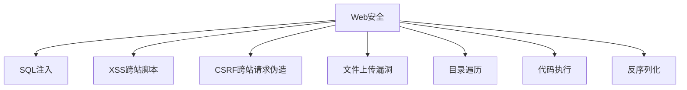

# CTF竞赛

CTF（Capture The Flag）是一种网络安全竞赛形式，参赛者需要在规定时间内解决各种安全挑战，获取隐藏的"旗帜"（Flag）。本专栏将分享CTF竞赛的解题思路、技巧和实战经验。

## 🏆 什么是CTF？

CTF是一种模拟真实网络安全场景的竞赛形式，通过解决各种安全挑战来提升参赛者的安全技能。它不仅是比赛，更是一种学习和实践网络安全技术的重要方式。

### CTF的价值
- **技能提升**：通过实战提升安全技能
- **知识学习**：学习最新的安全技术和漏洞
- **团队合作**：培养团队协作能力
- **职业发展**：为安全职业发展奠定基础

## 🎯 CTF题目类型

### 1. Web安全

**常见考点：**
- SQL注入：绕过过滤、盲注、时间盲注
- XSS：反射型、存储型、DOM型XSS
- 文件上传：绕过文件类型检查
- 代码执行：命令注入、代码注入

### 2. Pwn（二进制安全）
- **栈溢出**：利用栈溢出漏洞
- **堆溢出**：堆管理器的利用
- **格式化字符串**：格式化字符串漏洞
- **ROP链**：返回导向编程
- **Shellcode**：编写和执行shellcode

### 3. Crypto（密码学）
- **古典密码**：凯撒密码、维吉尼亚密码
- **现代密码**：RSA、AES、DES
- **哈希函数**：MD5、SHA系列
- **数字签名**：RSA签名、DSA签名
- **椭圆曲线**：ECC密码学

### 4. Reverse（逆向工程）
- **静态分析**：反汇编、反编译
- **动态分析**：调试、跟踪
- **加壳脱壳**：识别和脱去软件保护
- **反混淆**：去除代码混淆
- **算法还原**：还原加密算法

### 5. Misc（杂项）
- **隐写术**：图片、音频、视频隐写
- **取证分析**：日志分析、内存取证
- **网络分析**：流量分析、协议分析
- **编程**：算法实现、脚本编写

## 🛠️ 常用工具

### Web安全工具
- **Burp Suite**：Web应用安全测试平台
- **OWASP ZAP**：开源Web应用安全扫描器
- **SQLMap**：自动化SQL注入工具
- **XSSer**：XSS漏洞利用工具

### 二进制分析工具
- **GDB**：GNU调试器
- **IDA Pro**：专业反汇编器
- **Ghidra**：NSA开源逆向工程工具
- **Radare2**：开源逆向工程框架

### 密码学工具
- **CyberChef**：在线密码学工具
- **John the Ripper**：密码破解工具
- **Hashcat**：GPU加速密码破解
- **OpenSSL**：密码学库和工具

### 隐写术工具
- **Steghide**：图片隐写工具
- **Binwalk**：固件分析工具
- **ExifTool**：元数据分析工具
- **Audacity**：音频分析工具

## 📚 学习路径

### 入门阶段
- [CTF入门指南](./getting-started) - CTF基础知识介绍
- [Web题目解析](./web-challenges) - Web安全题目解题思路
- [Pwn题目解析](./pwn-challenges) - 二进制安全题目解析
- [Crypto题目解析](./crypto-challenges) - 密码学题目解析

### 进阶阶段
- [高级Web技巧](./advanced-web) - Web安全高级技巧
- [堆利用技术](./heap-exploitation) - 堆溢出利用技术
- [密码学进阶](./advanced-crypto) - 高级密码学技术
- [逆向工程进阶](./advanced-reverse) - 逆向工程高级技术

### 实战案例
- [CTF比赛复盘](./ctf-writeups) - 经典CTF比赛题目解析
- [漏洞利用链](./exploit-chains) - 复杂漏洞利用链构建
- [自动化脚本](./automation-scripts) - CTF自动化解题脚本

## 🏅 比赛平台

### 国际平台
- **CTFtime**：CTF比赛信息聚合平台
- **HackTheBox**：在线渗透测试平台
- **TryHackMe**：交互式网络安全学习平台
- **OverTheWire**：网络安全挑战平台

### 国内平台
- **XCTF**：全国网络安全竞赛平台
- **攻防世界**：网络安全技能竞赛平台
- **BugKu**：网络安全学习平台
- **i春秋**：网络安全在线教育平台

## 🎓 学习资源

### 在线课程
- **Cybrary**：免费网络安全课程
- **Coursera**：网络安全专业课程
- **edX**：MIT网络安全课程
- **Udemy**：CTF和渗透测试课程

### 书籍推荐
- 《CTF竞赛权威指南》
- 《Web应用安全权威指南》
- 《黑客攻防技术宝典》
- 《逆向工程核心原理》

### 社区资源
- **GitHub**：CTF题目和Writeup
- **Reddit**：r/netsec、r/securityCTF
- **Discord**：CTF社区服务器
- **Telegram**：CTF学习群组

## 🏆 参赛技巧

### 团队协作
- **角色分工**：根据技能特长分配任务
- **信息共享**：及时分享解题进展
- **工具准备**：提前准备常用工具和脚本
- **时间管理**：合理分配解题时间

### 解题策略
- **快速扫描**：快速浏览所有题目
- **难度评估**：评估题目难度和分值
- **优先级排序**：优先解决高分值题目
- **资源分配**：合理分配团队资源

### 技能提升
- **持续练习**：定期参加CTF比赛
- **学习Writeup**：学习他人的解题思路
- **工具熟练**：熟练掌握常用工具
- **知识更新**：关注最新的安全技术

## 🔗 相关链接

- [网络安全专栏](../cybersecurity/)
- [渗透测试专栏](../penetration-testing/)
- [漏洞分析专栏](../vulnerability-analysis/)
- [安全工具推荐](../tools/)

---

::: tip 学习建议
1. 从基础题目开始，逐步提升难度
2. 多参加比赛，积累实战经验
3. 学习他人的Writeup，拓宽思路
4. 建立自己的工具库和脚本库
5. 加入CTF社区，与其他选手交流
:::

::: info 贡献指南
如果你有CTF相关的解题思路或Writeup想要分享，欢迎提交PR或联系我。让我们一起提升CTF技能！
:::
