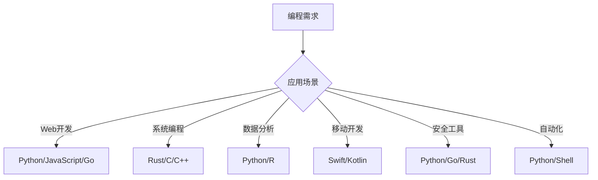

# 编程技术

编程技术专栏专注于分享各种编程语言的学习经验、开发技巧和最佳实践。从Python到Go、Rust，从Web开发到安全编程，这里将为你提供全面的编程技术指导。

## 💻 编程语言概览

### 为什么学习多种编程语言？
- **拓宽视野**：不同语言有不同的设计哲学和适用场景
- **提升技能**：掌握多种语言提高解决问题的能力
- **职业发展**：多语言技能在职场中更具竞争力
- **技术理解**：深入理解编程的本质和原理

### 语言选择指南

## 🐍 Python编程

### Python的优势
- **简洁易读**：语法简洁，代码可读性强
- **丰富的库**：拥有庞大的第三方库生态
- **跨平台**：支持多种操作系统
- **社区活跃**：拥有庞大的开发者社区

### 学习路径
- [Python基础](./python-basics) - 语法、数据类型、控制结构
- [数据结构与算法](./data-structures) - 常用数据结构和算法实现
- [面向对象编程](./oop) - 类、对象、继承、多态
- [异常处理](./exception-handling) - 错误处理和调试技巧

### 应用领域
- **Web开发**：Django、Flask、FastAPI
- **数据科学**：NumPy、Pandas、Matplotlib
- **机器学习**：TensorFlow、PyTorch、Scikit-learn
- **自动化**：脚本编写、任务自动化
- **安全工具**：渗透测试工具、漏洞扫描器

## 🌐 Web开发

### 前端技术
- **HTML/CSS/JavaScript**：Web开发基础
- **React/Vue/Angular**：现代前端框架
- **TypeScript**：类型安全的JavaScript
- **Webpack/Vite**：构建工具

### 后端技术
- [Django框架](./django) - Python全栈Web框架
- [Flask框架](./flask) - 轻量级Python Web框架
- [FastAPI框架](./fastapi) - 现代高性能API框架
- [API设计](./api-design) - RESTful API设计原则

### 全栈开发
- **前后端分离**：API + SPA架构
- **微服务架构**：服务拆分和部署
- **容器化**：Docker和Kubernetes
- **云部署**：AWS、Azure、阿里云

## 🔒 安全编程

### 安全编程原则
- **输入验证**：验证所有用户输入
- **输出编码**：防止XSS攻击
- **权限控制**：最小权限原则
- **错误处理**：安全的错误信息

### 安全开发实践
- [安全编程实践](./secure-coding) - 安全编码规范和技巧
- [密码学应用](./cryptography) - 加密算法和实现
- [安全工具开发](./security-tools) - 安全工具的设计和开发
- [自动化脚本](./automation-scripts) - 安全自动化脚本编写

### 常见安全漏洞
- **SQL注入**：数据库查询安全
- **XSS攻击**：跨站脚本攻击防护
- **CSRF攻击**：跨站请求伪造防护
- **文件上传漏洞**：文件上传安全

## 🚀 其他编程语言

### Go语言
- **并发编程**：Goroutine和Channel
- **微服务**：Go在微服务架构中的应用
- **性能优化**：Go程序性能调优
- **Web开发**：Gin、Echo等框架

### Rust语言
- **内存安全**：零成本抽象和内存安全
- **系统编程**：操作系统和嵌入式开发
- **WebAssembly**：Rust在WebAssembly中的应用
- **区块链**：Rust在区块链开发中的应用

### JavaScript/TypeScript
- **Node.js**：服务端JavaScript开发
- **前端框架**：React、Vue、Angular
- **全栈开发**：JavaScript全栈解决方案
- **工具链**：现代JavaScript开发工具

### Shell脚本
- **系统管理**：Linux系统管理脚本
- **自动化**：任务自动化和部署脚本
- **数据处理**：文本处理和数据分析
- **DevOps**：CI/CD流水线脚本

## 🛠️ 开发工具

### 代码编辑器
- **VS Code**：轻量级跨平台编辑器
- **PyCharm**：Python专业IDE
- **IntelliJ IDEA**：Java全栈IDE
- **Vim/Neovim**：终端编辑器

### 版本控制
- **Git**：分布式版本控制系统
- **GitHub/GitLab**：代码托管平台
- **Git Flow**：分支管理策略
- **代码审查**：Pull Request流程

### 测试工具
- **单元测试**：pytest、Jest、Go test
- **集成测试**：API测试、端到端测试
- **性能测试**：负载测试、压力测试
- **安全测试**：静态代码分析、动态测试

### 部署工具
- **Docker**：容器化部署
- **Kubernetes**：容器编排
- **CI/CD**：持续集成和部署
- **监控**：应用性能监控

## 📚 学习资源

### 在线课程
- **Coursera**：斯坦福、MIT等名校课程
- **edX**：哈佛、MIT等大学课程
- **Udemy**：实用技能课程
- **FreeCodeCamp**：免费编程课程

### 书籍推荐
- 《Python编程：从入门到实践》
- 《流畅的Python》
- 《Go语言圣经》
- 《Rust程序设计语言》
- 《JavaScript高级程序设计》

### 实践项目
- **个人博客**：全栈Web应用
- **API服务**：RESTful API开发
- **数据分析**：数据可视化项目
- **安全工具**：渗透测试工具开发
- **自动化脚本**：系统管理脚本

## 🎯 职业发展

### 职业方向
- **全栈开发工程师**：前后端技术栈
- **后端开发工程师**：服务端开发
- **前端开发工程师**：用户界面开发
- **DevOps工程师**：运维自动化
- **安全开发工程师**：安全工具开发

### 技能要求
- **编程基础**：算法、数据结构
- **框架掌握**：主流开发框架
- **数据库**：SQL和NoSQL数据库
- **系统设计**：分布式系统设计
- **软技能**：沟通、团队合作

### 面试准备
- **算法题**：LeetCode、牛客网
- **系统设计**：高并发系统设计
- **项目经验**：实际项目开发经验
- **技术深度**：对技术的深入理解

## 🔗 相关链接

- [网络安全专栏](../cybersecurity/)
- [渗透测试专栏](../penetration-testing/)
- [嵌入式安全专栏](../embedded-security/)
- [CTF竞赛专栏](../ctf/)

---

::: tip 学习建议
1. 选择一门主语言深入学习
2. 通过实际项目练习编程技能
3. 参与开源项目，提升代码质量
4. 关注技术趋势，持续学习新技术
5. 建立个人技术博客，分享学习心得
:::

::: info 贡献指南
如果你有编程相关的经验或技巧想要分享，欢迎提交PR或联系我。让我们一起提升编程技能！
:::
