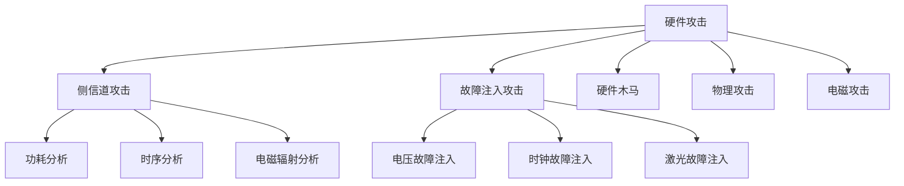

# 嵌入式安全

嵌入式安全是网络安全领域的重要分支，专注于保护嵌入式系统、IoT设备、工业控制系统等特殊环境下的安全。本专栏将深入探讨嵌入式安全的理论基础、攻击技术和防护策略。

## 🔧 什么是嵌入式安全？

嵌入式安全是指保护嵌入式系统免受恶意攻击、未经授权访问和数据泄露的安全措施。嵌入式系统广泛应用于智能家居、工业控制、医疗设备、汽车电子等领域，其安全性直接关系到用户隐私和系统可靠性。

### 嵌入式安全的特点
- **资源受限**：内存、存储、计算能力有限
- **实时性要求**：需要快速响应和低延迟
- **长期运行**：设备通常需要7x24小时运行
- **物理可访问**：设备可能被物理接触和攻击
- **多样化环境**：部署环境复杂多样

## 🎯 嵌入式安全威胁

### 1. 硬件攻击

### 2. 固件攻击
- **固件逆向**：分析固件代码和逻辑
- **固件植入**：植入恶意代码
- **固件更新攻击**：利用固件更新机制
- **引导加载程序攻击**：攻击Bootloader

### 3. 网络攻击
- **中间人攻击**：拦截和篡改通信
- **拒绝服务攻击**：使设备无法正常工作
- **协议攻击**：利用通信协议漏洞
- **无线攻击**：攻击WiFi、蓝牙等无线通信

## 🛡️ 嵌入式安全防护

### 1. 硬件安全
- **安全芯片**：使用专用安全芯片
- **硬件加密**：硬件加速的加密算法
- **物理防护**：防篡改和防侧信道攻击
- **安全启动**：确保系统启动的完整性

### 2. 固件安全
- **代码签名**：验证固件的完整性
- **安全更新**：安全的固件更新机制
- **代码混淆**：保护固件代码不被逆向
- **运行时保护**：运行时检测和防护

### 3. 通信安全
- **加密通信**：使用强加密算法
- **身份认证**：设备身份验证
- **访问控制**：限制设备访问权限
- **安全协议**：使用安全的通信协议

## 📚 学习路径

### 基础阶段
- [嵌入式安全概述](./overview) - 嵌入式安全基础概念
- [硬件安全](./hardware-security) - 硬件安全威胁和防护
- [固件安全](./firmware-security) - 固件安全分析
- [IoT安全](./iot-security) - 物联网安全挑战

### 进阶阶段
- [侧信道攻击](./side-channel-attacks) - 侧信道攻击技术
- [固件逆向](./firmware-reverse) - 固件逆向工程
- [硬件调试](./hardware-debugging) - 硬件调试技术
- [安全启动](./secure-boot) - 安全启动机制

## 🛠️ 常用工具

### 硬件分析工具
- **示波器**：分析信号和时序
- **逻辑分析仪**：分析数字信号
- **频谱分析仪**：分析电磁辐射
- **JTAG调试器**：硬件调试接口

### 固件分析工具
- **IDA Pro**：专业反汇编器
- **Ghidra**：NSA开源逆向工具
- **Binwalk**：固件分析工具
- **Firmware Analysis Toolkit**：固件分析套件

### 安全测试工具
- **ChipWhisperer**：侧信道攻击平台
- **Glitchy**：故障注入工具
- **Facedancer**：USB设备模拟器
- **Bus Pirate**：通用总线分析器

## 🏭 应用领域

### 智能家居
- **智能门锁**：防止物理和网络攻击
- **智能摄像头**：保护隐私和数据安全
- **智能音箱**：防止窃听和数据泄露
- **智能家电**：确保设备安全运行

### 工业控制
- **PLC安全**：保护工业控制系统
- **SCADA安全**：监控和数据采集系统安全
- **工业网络**：工业以太网安全
- **设备管理**：工业设备安全管理

### 汽车电子
- **车载网络**：CAN总线安全
- **自动驾驶**：自动驾驶系统安全
- **车联网**：车辆通信安全
- **ECU安全**：电子控制单元安全

### 医疗设备
- **医疗设备安全**：保护患者数据
- **远程监控**：医疗数据安全传输
- **设备认证**：医疗设备身份验证
- **合规要求**：满足医疗安全标准

## 🔬 研究热点

### 新兴威胁
- **AI攻击**：利用AI技术进行攻击
- **量子攻击**：量子计算对加密的威胁
- **供应链攻击**：针对供应链的安全攻击
- **零日漏洞**：未知漏洞的发现和利用

### 防护技术
- **零信任架构**：不信任任何设备的安全模型
- **行为分析**：基于设备行为的异常检测
- **区块链安全**：区块链在IoT中的应用
- **边缘计算安全**：边缘计算环境的安全防护

## 🎓 职业发展

### 职业方向
- **嵌入式安全工程师**：负责嵌入式系统安全设计
- **IoT安全专家**：专注于物联网安全
- **硬件安全研究员**：研究硬件安全技术
- **安全架构师**：设计整体安全架构

### 技能要求
- **硬件知识**：了解硬件原理和设计
- **编程技能**：C/C++、汇编语言
- **安全知识**：密码学、网络安全
- **工具使用**：熟练使用各种分析工具

### 认证体系
- **CISSP**：信息系统安全专家
- **CEH**：道德黑客认证
- **GICSP**：全球工业网络安全专家
- **SANS**：SANS安全认证

## 🔗 相关链接

- [网络安全专栏](../cybersecurity/)
- [渗透测试专栏](../penetration-testing/)
- [Python开发专栏](../python-development/)
- [CTF竞赛专栏](../ctf/)

---

::: warning 重要提醒
嵌入式安全研究必须在合法授权的环境下进行。未经授权的安全测试可能构成违法行为，请务必遵守相关法律法规。
:::

::: info 贡献指南
如果你有嵌入式安全相关的经验或研究想要分享，欢迎提交PR或联系我。让我们一起推动嵌入式安全技术的发展！
:::
